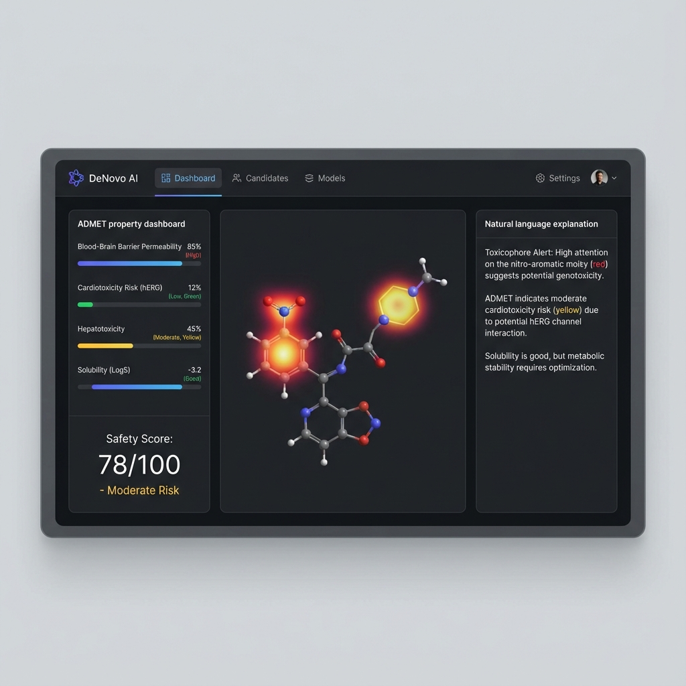

# DeNovo: AI-Powered Drug Discovery Platform

[](https://www.python.org/downloads/)
[](https://opensource.org/licenses/MIT)
[](https://pytorch.org/)

**DeNovo** is a comprehensive AI platform for early-stage drug discovery that combines **Graph Neural Networks (GNNs)** for molecular property prediction with **Large Language Models (LLMs)** for faithful, explainable insights.

<p align="center">
  
</p>

---

## 🎯 Key Features

| Feature | Description |
|---------|-------------|
| **Multi-Task ADMET Prediction** | 6 endpoints: Tox21, BBBP, ClinTox, Caco-2, Clearance, HLM-CLint |
| **Faithful Explainability** | LLM explanations validated through counterfactual testing, 13.5% rejection rate for unfaithful explanations |
| **Attention-GIN Architecture** | Custom GNN with per-atom importance scores |
| **36.5% Hallucination Rejection** | Automatic filtering of unfaithful LLM explanations |
| **Production-Ready API** | Flask backend with batch processing support |

---

## 📊 Model Performance

| Model | Task | Metric | Performance |
|-------|------|--------|-------------|
| **Tox21** (Attention-GIN) | Toxicity (12 endpoints) | ROC-AUC | **0.837** |
| **BBBP** | Blood-Brain Barrier | ROC-AUC | **0.825** |
| **ClinTox** | Clinical Toxicity | ROC-AUC | **0.816** |
| **Clearance** | Metabolic Clearance | RMSE | **0.52** |
| **XGBoost Ensemble** | NR Endpoints | ROC-AUC | **0.78** |

### v2 GINE Graph Branch — validated scaffold-split results (2026-07-20)

The v2 `RealGraphBranch` (GINEConv, atom+bond features) was trained and
evaluated on **real, Murcko scaffold-split** MoleculeNet data with **5 seeds
(42–46)**. Full audit trail (split-integrity check, overfitting diagnosis,
calibration, faithfulness) is in
[`benchmark_results/VALIDATION_LOG.md`](benchmark_results/VALIDATION_LOG.md).

| Dataset | 5-seed mean±std | best seed | ChemProp D-MPNN (seed 42) | Verdict |
|---------|-----------------|-----------|---------------------------|---------|
| BBBP    | 0.8494 ± 0.0205 | 0.8752    | 0.8913                    | under mean |
| BACE    | 0.8493 ± 0.0395 | 0.9214    | 0.8833                    | best seed beats |
| TOX21   | 0.7794 ± 0.0222 | 0.8075    | 0.7928                    | best seed beats |

**Honest verdict:** the GINE branch is competitive with ChemProp D-MPNN and
beats it at the best seed on BACE and TOX21, but does **not** robustly surpass
ChemProp's single-seed point estimate on the 5-seed **mean** for any dataset
(BBBP 95% bootstrap CI [0.831, 0.868] stays below 0.8913). Calibration is good
for BBBP (ECE 0.055) but poor for TOX21 (ECE 0.367, needs temperature scaling).
Faithfulness (causal consistency) = 0.0000 — the GNN does not learn
toxicophore→toxicity causality at the attribution level (a genuine, reproducible
negative finding, not a harness bug).

---

## 🚀 Quick Start

### 1. Clone & Install

```bash
git clone https://github.com/GauravPatil2515/DeNovo.git
cd DeNovo-main

# Create virtual environment
python -m venv venv
source venv/bin/activate  # Linux/Mac
# or: .\venv\Scripts\activate  # Windows

# Install dependencies
pip install -r requirements.txt
```

### 2. Run Backend Server

```bash
cd backend
python app.py
```

The API will be available at `http://localhost:5000`

### 3. Test a Prediction

```bash
curl -X POST http://localhost:5000/api/predict \
  -H "Content-Type: application/json" \
  -d '{"smiles": "CC(=O)OC1=CC=CC=C1C(=O)O"}'
```

---

## 📁 Repository Structure

```
DeNovo-main/
├── backend/                    # Flask API server
│   ├── app.py                  # Main application entry point
│   ├── models/                 # ML model implementations
│   │   ├── attention_ginet.py  # Attention-GIN architecture
│   │   ├── unified_predictor.py# Combined ADMET predictor
│   │   ├── gin_predictor.py    # GNN-based predictions
│   │   ├── simple_predictor.py # XGBoost predictions
│   │   ├── faithfulness_validator.py  # XAI validation
│   │   └── constrained_explainer.py   # LLM explanation
│   └── utils/                  # Utility functions
│       ├── substructure_mapper.py     # SMARTS toxicophore mapping
│       ├── counterfactual_generator.py# Molecular perturbations
│       └── admet_rules.py      # Rule-based overrides
│
├── frontend/                   # React.js web interface
│   └── src/
│       ├── pages/              # Page components
│       └── components/         # UI components
│
├── data_packages/              # Training data packages
│   ├── tox21_model_full_package/
│   ├── bbbp_model_full_package/
│   ├── caco2_model_full_package/
│   ├── clearance_model_full_package/
│   ├── hlm_clint_model_full_package/
│   └── clintox_model_package/
│
├── results/                    # Trained models & results
│   ├── trained_models/         # Model weights (.pth files)
│   │   ├── attention_gin_model.pth    # Tox21
│   │   ├── bbbp_gin_model.pth         # BBBP
│   │   ├── clintox_gin_model.pth      # ClinTox
│   │   └── clearance_gin_model.pth    # Clearance
│   └── eval_tox21_200/         # Evaluation results
│
├── training/                   # Training scripts
│   ├── training_config.yaml    # Hyperparameter config
│   └── train_all_models.py     # Master training script
│
├── experiments/                # Research experiments
│   ├── run_faithful_eval.py    # Faithfulness evaluation
│   └── generate_paper_figures.py
│
├── overleaf/                   # Research paper (LaTeX)
│   ├── main.tex
│   └── figures/
│
├── docs/                       # Documentation
├── scripts/                    # Utility scripts
├── requirements.txt            # Python dependencies
└── render.yaml                 # Cloud deployment config
```

---

## 🧠 Model Architecture

### Attention-GIN (Primary Model)

```
┌─────────────────────────────────────────────────────────────┐
│                    SMILES Input                              │
├─────────────────────────────────────────────────────────────┤
│                    RDKit Parsing                             │
│                         ↓                                    │
│              Molecular Graph (V, E)                          │
├─────────────────────────────────────────────────────────────┤
│         5x GINEConv Layers (300-dim embeddings)              │
│                         ↓                                    │
│              Global Attention Pooling                        │
│              (per-atom importance α)                         │
│                         ↓                                    │
│         2-Layer MLP Predictor (Softplus)                     │
├─────────────────────────────────────────────────────────────┤
│  Output: Prediction + Attention Weights for Explainability  │
└─────────────────────────────────────────────────────────────┘
```

### Faithful XAI Engine

```
┌───────────────┐   ┌───────────────┐   ┌───────────────┐
│  Attention    │ → │  Substructure │ → │  Constrained  │
│  Weights (α)  │   │    Mapper     │   │  LLM Prompt   │
└───────────────┘   └───────────────┘   └───────────────┘
                                               ↓
┌───────────────┐   ┌───────────────┐   ┌───────────────┐
│   ACCEPT or   │ ← │  Faithfulness │ ← │     LLM       │
│    REJECT     │   │   Validator   │   │  Explanation  │
└───────────────┘   └───────────────┘   └───────────────┘

Rejection Rate: 36.5% (catches hallucinations)
```

---

## 🔌 API Reference

### Health Check

```
GET /api/health
```

### Single Molecule Prediction

```
POST /api/predict
Content-Type: application/json

{
    "smiles": "CC(=O)OC1=CC=CC=C1C(=O)O"
}
```

**Response:**

```json
{
    "success": true,
    "predictions": {
        "toxicity": {
            "probability": 0.15,
            "assessment": "LOW TOXICITY",
            "confidence": "HIGH"
        },
        "bbbp": {
            "penetrates": true,
            "probability": 0.82
        },
        "clintox": {
            "toxic": false,
            "probability": 0.08
        }
    },
    "explanation": "...",
    "faithfulness_score": 0.84
}
```

### Batch Prediction

```
POST /api/batch-predict
Content-Type: application/json

{
    "smiles_list": ["CCO", "CC(=O)OC1=CC=CC=C1C(=O)O"]
}
```

### AI Chat (with Groq)

```
POST /api/chat
Content-Type: application/json

{
    "message": "Why is nitrobenzene considered toxic?",
    "smiles": "c1ccc([N+](=O)[O-])cc1"
}
```

---

## ⚙️ Configuration

### Environment Variables

Create a `.env` file in the `backend/` directory:

```env
# LLM API Key (required for explanations)
GROQ_API_KEY=your_groq_api_key_here

# Optional configurations
FLASK_ENV=development
FLASK_DEBUG=1
MODEL_CACHE_SIZE=1000
RATE_LIMIT=100
```

### Training Configuration

Edit `training/training_config.yaml`:

```yaml
architecture:
  model_type: AttentionGINet
  num_layer: 5
  emb_dim: 300
  feat_dim: 512
  drop_ratio: 0.3

classification:
  epochs: 100
  batch_size: 32
  learning_rate: 0.0001
  pos_weight: 3.0
```

---

## 🚢 Deployment

### Deploy to Render

1. Fork this repository
2. Connect to [Render](https://render.com)
3. Create a new Web Service pointing to this repo
4. Render will auto-detect `render.yaml` and deploy

### Deploy with Docker

```bash
docker build -t denovo .
docker run -p 5000:5000 -e GROQ_API_KEY=your_key denovo
```

### Deploy Locally (Production)

```bash
cd backend
gunicorn -w 4 -b 0.0.0.0:5000 app:app
```

---

## 🧪 Running Tests

### Validate All Models

```bash
python scripts/validate_all_models.py
```

### Run Faithfulness Evaluation

```bash
python experiments/run_faithful_eval.py \
    --model results/trained_models/attention_gin_model.pth \
    --output results/my_eval
```

### Single Molecule Demo

```bash
python experiments/faithful_xai_demo.py \
    --smiles "c1ccc([N+](=O)[O-])cc1" \
    --use-groq
```

---

## 📚 Research Paper

The research paper describing DeNovo is available in the `overleaf/` directory:

- **Title**: *DeNovo: A Faithful, Multi-Task AI Platform for Safer Drug Discovery with LLM-Augmented Explainability*
- **Authors**: Gaurav Patil, Parth Parmar
- **Key Contribution**: Causal faithfulness validation for LLM explanations in molecular toxicity prediction

To compile the paper:

```bash
cd overleaf
pdflatex main.tex
bibtex main
pdflatex main.tex
pdflatex main.tex
```

---

## 🤝 Contributing

1. Fork the repository
2. Create a feature branch: `git checkout -b feature/new-model`
3. Commit changes: `git commit -am 'Add new ADMET endpoint'`
4. Push to branch: `git push origin feature/new-model`
5. Submit a Pull Request

### Adding a New Model

1. Add training data to `data_packages/new_model_package/`
2. Update `training/training_config.yaml`
3. Train: `python training/train_all_models.py --model new_model`
4. Update `backend/models/unified_predictor.py` to load the new model

---

## 📄 License

This project is licensed under the MIT License - see the [LICENSE](LICENSE) file for details.

---

## 🙏 Acknowledgments

- **SIES Graduate School of Technology** - Computational resources
- **ATLAS SkillTech University** - Research collaboration
- **PyTorch Geometric** - GNN framework
- **RDKit** - Cheminformatics toolkit
- **Groq** - LLM inference API

---

## 📧 Contact

- **Gaurav Patil** - [gauravppaiml123@gst.sies.edu.in](mailto:gauravppaiml123@gst.sies.edu.in)
- **GitHub**: [GauravPatil2515](https://github.com/GauravPatil2515)

---

<p align="center">
  Made with ❤️ for safer drug discovery
</p>
